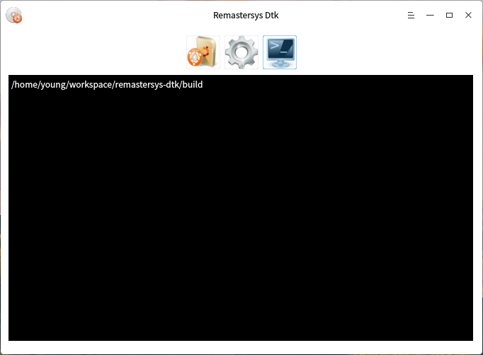

# Remastersys-dtk

Remastersys-dtk is a system backup tool.

## Screenshots

### Actions

### Settings

### Output

## Dependencies

    $ sudo apt install g++ qt5-default libdtkcore-dev libdtkwidget-dev

## Installation

    $ mkdir build
    $ cd build
    $ qmake ..
    $ make
    $ ./remastersys-dtk

Copyright (C) 2017 [Mutse Young](https://mutse.github.io)
